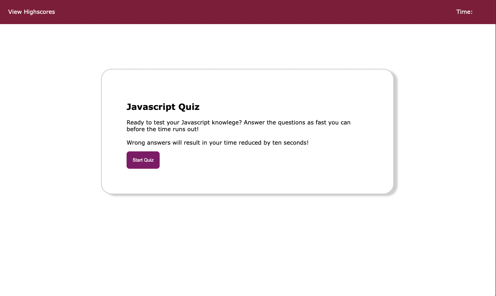
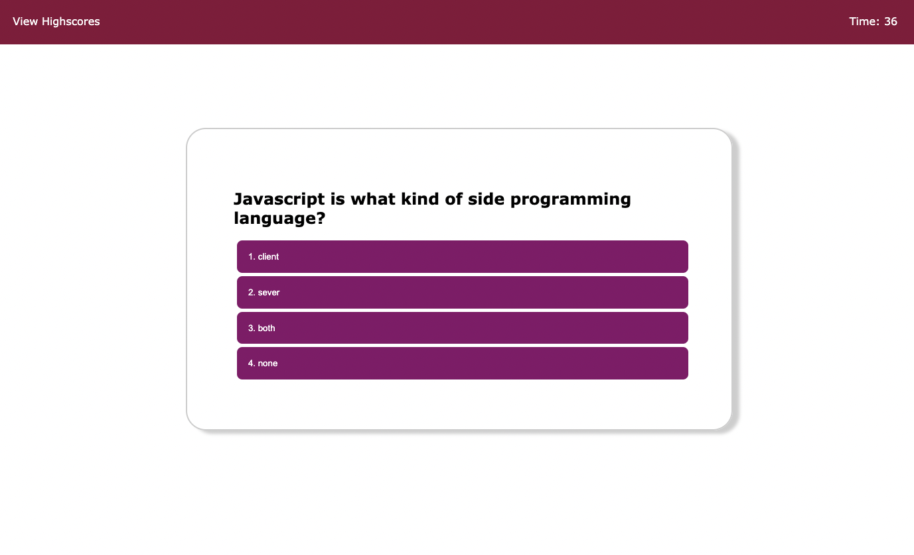

# javascript-quiz-hw4

# Description

In this assginment we were tasked with creating a coding quiz. I specifically made my quiz focus on Javascript. We needed to make sure that as the user took the quiz, they were able to see the time reamining. We also needed to make sure that the user would recieve a time penality if they got the answer wrong. By the end of the quiz, the user should be able see their score and had the option of putting in their itials so that it will be saved in the learderboard.

# Links

https://github.com/GirlxCode/javascript-quiz-hw4

https://girlxcode.github.io/javascript-quiz-hw4/